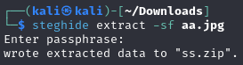

# TryHackMe - Lian_Yu WriteUp

Walkthrough de la máquina Lian_Yu de TryHackMe. A través de este documento se expondrán los pasos seguidos para vulnerar y completar la máquina Lian_Yu.

**1.** Escaneamos la IP proporcionada en busca de servicios abiertos: `sudo nmap -A -sV -T4 -vvv 10.10.5.141`.

**2.** Visitamos la página web alojada en el puerto 80.

**3.** Tratamos de averiguar posibles directorios del sitio web: `gobuster dir -e -u http://10.10.5.141/ -w /usr/share/dirbuster/wordlists/directory-list-lowercase-2.3-medium.txt`. De esta forma encontramos el directorio ***/island***, así que accedemos a él, donde descubrimos un posible nombre de usuario: **vigilante**.

**4.** Usamos gobuster de nuevo, pero a partir del directorio */island*: `gobuster dir -e -u http://10.10.5.141/island -w /usr/share/dirbuster/wordlists/directory-list-lowercase-2.3-medium.txt`. De esta forma damos con el subdirectorio ***/island/2100***.

**5.** Si analizamos el código fuente de la página actual, veremos al fondo una pista. En esta se nos indica una extensión **.ticket**, por lo que probaremos a realizar fuzzing contra la página web, empleando esta extensión: `wfuzz -u http://10.10.5.141/island/2100/FUZZ.ticket -w /usr/share/dirbuster/wordlists/directory-list-2.3-medium.txt -c -- hc 404`. De esta manera, encontramos el directorio **/green_arrow.ticket**.

Otra forma de llegar al mismo resultado es emplear de nuevo gobuster, cambiando las opciones para incluir la extensión .ticket: `gobuster dir -u http://10.10.5.141/island/2100 -w /usr/share/dirbuster/wordlists/directory-list-2.3-medium.txt -t 40 -x ticket`.

**6.** Accedemos a la URL recién obtenida: `http://10.10.5.141/island/2100/green_arrow.ticket`. En ella obtenemos lo que parece un mensaje encriptado en *Base*, pero no sabemos si 32, 64, 58, etc, de modo que probamos hasta que damos con la solución.

**7.** Después de intentarlo con base32 y base 64, al probar con base58 obtenemos una contraseña: `echo "RTy8yhBQdscX" | base58 -d`.

**8.** Probamos entrar a la máquina por el puerto 21 (FTP) con las crendenciales obtenidas previamente (vigilante/!#th3h00d).

**9.** Dentro de la máquina descubrimos tres imágenes, de modo que las descargamos con el comando `get`.

**10.** Si abrimos la carpeta Downloads veremos que la imagen Leave_me_alone.png está dañada, no dejándonos ver su contenido. Para arreglarlo, emplearemos el editor hexadecimal GHex en dicha imagen. Para ello debemos tener en cuenta los 'Magic Numbers' que identifican en hexadecimal un fichero .PNG, que son `89 50 4E 47 0D 0A 1A 0A`. Una vez abierto el editor, veremos que los primeros números no coinciden con los del formato PNG, por lo que los cambiaremos.

**11.** Ya arreglada la imagen en formato png, nos dará la contraseña **password**, que usaremos con **steghide** sobre la imagen aa.jpg con el comando `steghide extract -sf aa.jpg`. De esta forma, obtendremos un archivo comprimido en formato zip con dos archivos de texto.

**12.** Descomprimimos el archivo .zip, y usamos `cat` sobre los dos archivos de texto. En el segundo (*shado*), veremos lo que parece ser un usuario o una contraseña.

**13.** Aún así no es suficiente, necesitamos el usuario o contraseña, de modo que probamos a abrir las otras imágenes, y realizamos una búsqueda reversa en Google Images, encontrando algo interesante. Si llevamos a cabo este proceso sobre la imagen aa.jpg, obtendremos el nombre del personaje, que resulta ser DeathStroke, también conocido como Slade Wilson. Entonces probaremos su nombre como usuario.

**14.** Entramos vía SSH usando el usuario slade y la contraseña M3tahuman: `ssh slade@10.10.5.141`.

**15.** Navegamos en la carpeta y encontramos la primera flag.

**16.** Si ejecutamos el comando `sudo -l`, veremos que podemos ejecutar comandos como root con `/usr/bin/pkexec`, por lo que probamos a extraer la flag del root con este método: `sudo /usr/bin/pkexec cat /root/root.txt`.

